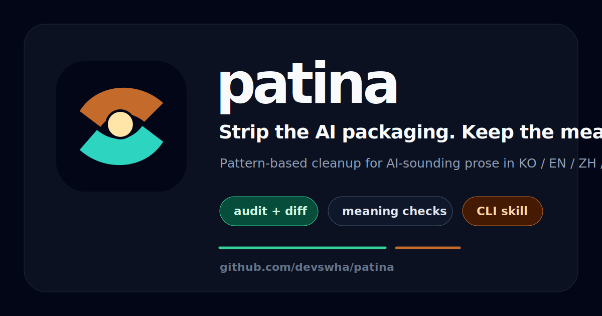

# patina-action

<p align="center">
  
</p>

GitHub Action for Patina prose hotspot scoring. It checks Markdown changed in a pull request, writes a sticky review comment, and can fail the job when a file crosses your score threshold.

> Release note: the default package source is `patina-cli@latest`. The v1 tag should be cut after `patina-cli` is published to npm. Until then, test with `patina-package: github:devswha/patina`.

## Usage

```yaml
name: Patina prose score

on:
  pull_request:
    paths:
      - '**/*.md'
      - '**/*.mdx'

permissions:
  contents: read
  pull-requests: read
  issues: write

jobs:
  patina:
    runs-on: ubuntu-latest
    steps:
      - uses: actions/checkout@v6
      - uses: devswha/patina-action@v1
        with:
          score-threshold: 30
          comment: true

      # Pre-v1 testing only, before patina-cli is on npm:
      # - uses: devswha/patina-action@main
      #   with:
      #     patina-package: github:devswha/patina
      #     score-threshold: 30
```

The Action uses `dorny/paths-filter@v4` to find changed Markdown files, runs the `patina-score` binary from `npx -p patina-cli@latest`, and updates a sticky PR comment via `peter-evans/create-or-update-comment@v5`.

## Inputs

| Input | Default | Meaning |
|---|---:|---|
| `github-token` | `${{ github.token }}` | Token for change detection and comments. |
| `files` | changed PR Markdown | Optional newline/comma/JSON file list. Overrides paths-filter. |
| `lang` | `auto` | `auto`, `ko`, `en`, `zh`, or `ja`. |
| `score-threshold` | unset | If set, fail when any file score is above this percentage. |
| `report-threshold` | `30` | Advisory report gate when `score-threshold` is unset. |
| `max-files` | `50` | Maximum Markdown files to score. |
| `comment` | `true` | Create or update a sticky PR comment. |
| `patina-package` | `patina-cli@latest` | npm package spec used by `npx`. |
| `patina-bin` | unset | Local `patina-score` executable for tests/self-hosted runners. |

## Outputs

| Output | Meaning |
|---|---|
| `file-count` | Number of Markdown files scored. |
| `failed-count` | Number of files above the active threshold. |
| `max-score` | Highest file score percentage. |
| `threshold-failed` | `true` when `score-threshold` was set and exceeded. |
| `comment-body-path` | Path to the generated Markdown comment body. |

## Notes for forks

For public repositories, GitHub limits `GITHUB_TOKEN` permissions on `pull_request` runs from forks. If comments are blocked, keep the score summary in the job output or run a carefully locked-down `pull_request_target` workflow.
